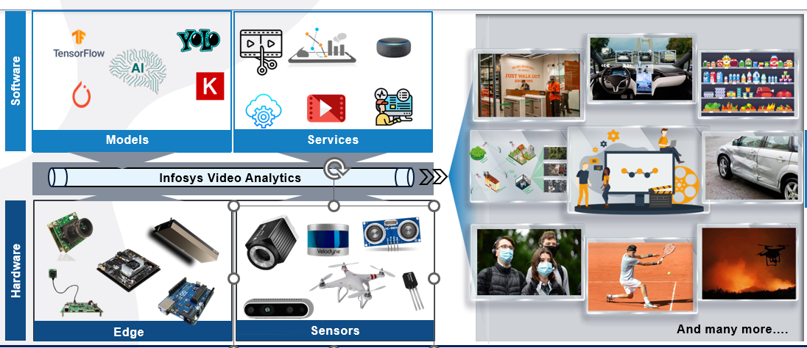
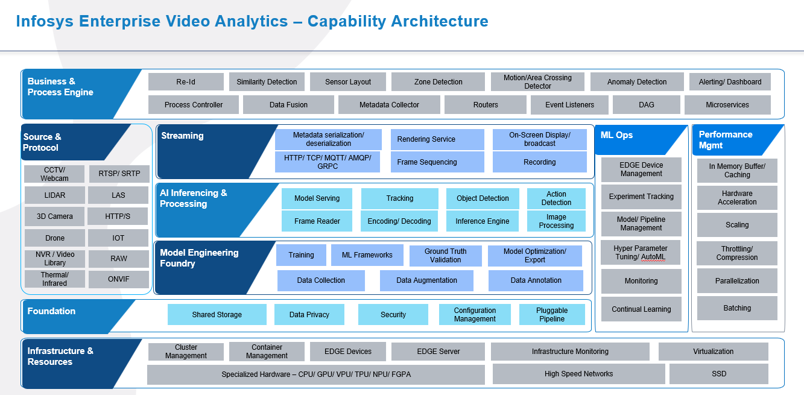
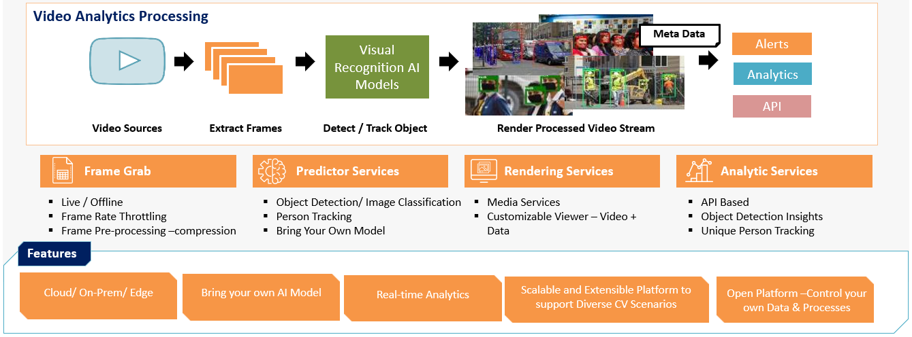
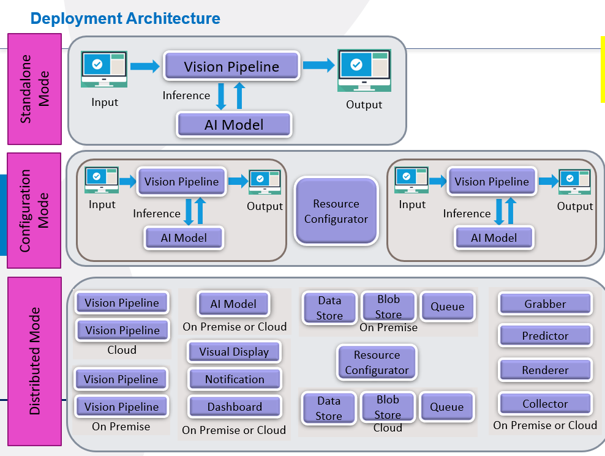

# Infosys Video Analytics

### Introduction

Infosys Video Analytics(IVA) is constructed using .NET 6.0. It reads frames from a video file and makes an API call to the Python Inference API pipeline by sending a JSON request (refer to [References](#-References) section). The response from the Python Inference pipeline is then used to render the output video. This tool is designed to facilitate video analysis and processing using advanced machine learning models.

IVA(Infosys IP) offers a flexible, vendor-neutral approach for end-to-end Computer Vision services. It supports a range of AI models, including cutting-edge next-gen Generative AI, pre-configured for diverse vision tasks. Additionally multiple hardware like NVidia Jetson, Raspberry, Drone etc. are supported with IVA. IVA seamlessly blends on-premise, Cloud, Edge, AI & Vision technologies.


## Table of Contents
- [Installation](#-Installation)
- [Getting Started](#-Getting-Started)
- [Prerequisites](#-Prerequisites)
- [Architecture](#-Architecture)
- [Workflow](#-Workflow)
- [Build and Test](#-Build-and-Test)
- [Tests](#%EF%B8%8F-contacts)
- [Additional Features](#-Additional-Features)
- [References](#-References)

### Installation

How to build the project:
```shell
#Open a terminal (Command Prompt or PowerShell for Windows, Terminal for macOS or Linux)

#Ensure Git is installed
Visit https://git-scm.com to download and install console Git if not already installed

# Clone the Repository
  git clone https://github.com/Infosys-ainautosolutions-iva/OSS-Infosys-Video-Analytics.git

# Check if .Net is installed
  dotnet --version  # Check the installed version of .NET SDK (Ensure .NET 6.0 is installed)
# Visit the official Microsoft website to install or update it if necessary

# Restore dependencies
  dotnet restore

# Compile the project
  dotnet build
```

### Getting Started



This section guides users through setting up and running the IVA on their system.

### Prerequisites (Install Dependencies)

- **7-Zip or WinZip**: Required to unzip the binaries folder.
- **.NET 6.0**: Ensure .NET 6.0 is installed on the computer where the pipeline will be run.
- **Windows OS**: Windows 10 or greater.
- **Windows Server**: If running on a server, Windows Server 2012 R2 or greater.
- **VLC Player**: Required to view the video output. Ensure the latest version is installed.

### Architecture



- **Framework**: IVA is constructed using .NET 6.0.
- **Data Flow**:

  - Reads frames from a video/image file.
  - Sends a JSON request to the Python Inference API pipeline. (refer to [References](#-References) section for sample JSON request and response structures)
  - Receives the response and renders the output video.
- **Components**:

  - **Frame Grabber**: Captures frames from the input video/image.
  - **Frame Predictor**: Processes frames using the Python model API.
  - **Data Collector**: Collects data for further processing.
  - **Frame Renderer**: Renders the processed frames into a video.
    Data Collector
  - This module stores AI prediction metadata to the database. It can be used for downstream applications, analytics and notification purposes.
  - It comprises of SQL Server database (for persistent storage), Blob storage (for temporary storage), Queue- MSMQ, Kafka (for transient storage of messages), disk storage. SQL stores structured data like prediction results from AI models, Blob stores image frames, Queue stores messages which are transmitted through various modules of pipeline, disks can store image, videos.
    Rendering:
  - The rendering part is modified as per the new schema for the models and conditions for executing specific models are specified in the configuration file based on that model is executed.
  - Multiple attributes are set for the models based on that it will render model and generate the output video.
- **Workflow**:

  1. Upload the image/video to IVA.
  2. The Frame Grabber captures frames and transmits them to the Frame Predictor.
  3. The Frame Predictor forwards the data to the Data Collector and Frame Renderer.
  4. The rendered video output can be viewed using VLC media player.

  ##### Overall Architecture Diagramatic Representation



###🚀 Build and Test (Usage) (IVA SetUp)

1. **Extract the IVA-open source archive**: Use 7-Zip or WinZip to unzip the binaries folder to a directory of your choice.
2. **Build the Solution**:
   - Navigate to the IVA directory.
   - Clean and build the solution.
   - Set the startup project to the FrameGrabber build the solution and again make process loader project as startup project and rebuild the entire solution.
3. **Configuration Files**:
   - Open Process loader folder.
   - Modify the following configuration files as needed:
     - `LiSettings.json`: Specify the complete path of the LIF adapter DLL from the references folder.(All 4 DLL's)
     - `Process.Config`, `Device.json`, `config.ini`: Used for Python network execution, located in the Configuration folder.
     - `ModelType.xml`: Located in the XML folder from AIModels inside Prediction folder, In xml we can use 2cases to test the solution:1)Local Python Execution and 2)API
     - `PythonModelExecutor.py`: The entry point for all Python network executions. Modifications to this file do not require a solution rebuild.
     - `Appsetting.json`: Specify the path to `device.json` from process loader inside Configurations folder and SQL connection strings if needed.
4. **Testing**:
   - Update `device.json`, `appsettings.json`, `lisettings.json`, and the XML file to specify the model API to be tested.
   - Place the input video file or image in the designated input directory.
   - Execute `processloader.exe` to initiate the command prompt. FFmpeg will start, and the output will be generated as `pd.flv`.

### Tests:

#### Steps for Local Python Inference with IVA Setup

1. Required Files: (Files inside Process loader bin folder)
   - config.ini file
   - HeatMap.py
   - python_model_loader.py
   - PythonModelExecutor.py
   - Python Executor setup folder
   - Python >=3.9 (Ensure it is installed on the machine to run Python inference)
2. Installation Steps:
   - Install Necessary Packages:
   - Verify installed packages using:
   - Install any missing packages.
3. Install Wheel File:

Navigate to the model inference directory and locate the wheel file.

- In the command prompt, run:
- Replace <path_to_wheel_file> with the actual path of the wheel file.
- You can perform similar tests with your model using the necessary Python environment. Ensure the following given steps are completed:
- Set Up the Python Environment

4. Run the Model:

- Execute the necessary scripts to perform inference with your model.

### Steps for API Testing with IVA Setup

1. Deploy the API:

   - Based on the provided IVA request and response structure (refer to [References](#-References) section), deploy the API for testing.
2. Configure API Endpoint:

   - Specify the API endpoint in the XML file.
   - Set the keyword for the model you are testing in the predictionModel field in device.json.
3. Modify Configuration Files:

   - Update the following configuration files in Processloader project as needed:
   - LiSettings.json: Specify the path of the LIF adapter DLL from the references folder.
   - Process.Config
   - Device.json
   - config.ini (used for Python net execution)
   - These files are located in the Configuration folder.
4. Update XML File:

   - ModelType.xml file is located in the XML folder from AIModels inside Prediction folder.
5. Python Net Execution:

   - PythonModelExecutor.py is the entry file for all Python net executions. Modifying this file does not require a solution build.
6. App Settings:

   - In Appsetting.json, specify the path of device.json from process loader project inside Configuration folder.

### Additional Features

#### Real-Time Video Processing

- **Live Video Feed**: IVA can process live video feeds from a camera. Configure `CAMERA_URL` to the camera's URL or set it to `0` for the default camera.
- **Streaming Options**: Supports various streaming options, including RTSP and HTTP streams.

#### Model Integration

- **Custom Models**: Integrate custom machine learning models by updating the `ModelType.xml` and `PythonModelExecutor.py` files.
- **Model Switching**: Easily switch between different models by modifying the `PREDICTION_MODEL` attribute in `device.json`.

#### Advanced Configurations

- **Frame Rate Control**: Adjust the frame rate for processing by setting the `FRAMETOPREDICT` attribute in `device.json`.
- **Output Formats**: Supports multiple output formats, including FLV, MP4, and AVI. Configure the output format in `appsettings.json`.

#### Logging and Debugging

- **Verbose Logging**: Enable verbose logging for detailed debugging information. Modify the logging level in `appsettings.json`.
- **Error Handling**: Comprehensive error handling mechanisms to ensure robust performance. Check log files for error details.

#### Performance Optimization

- **GPU Acceleration**: Leverage GPU acceleration for faster processing. Ensure the necessary CUDA libraries are installed and configured.
- **Batch Processing**: Process multiple videos or images in batch mode. Configure batch processing settings in `device.json`.

#### User Interface

- **Web Dashboard**: IVA includes a web-based dashboard for monitoring and controlling the processing pipeline. Access the dashboard via the specified URL in `appsettings.json`.

#### Security

- **Authentication**: Implement authentication mechanisms to secure the API endpoints. Configure authentication settings in `appsettings.json`.
- **Data Encryption**: Ensure data privacy by enabling encryption for data transmission. Modify encryption settings in the configuration files.

and much more.

This IVA is ideal for both new users and experienced developers seeking specific technical details or support.

📚 References:

For sample input schema examples, please read[Docs/IVA-Input_Schema.md](Docs/IVA-Input_Schema.md)
For sample output schema, please read [Docs/IVA-Output_Schema.md)](Docs/IVA-Output_Schema.md)
