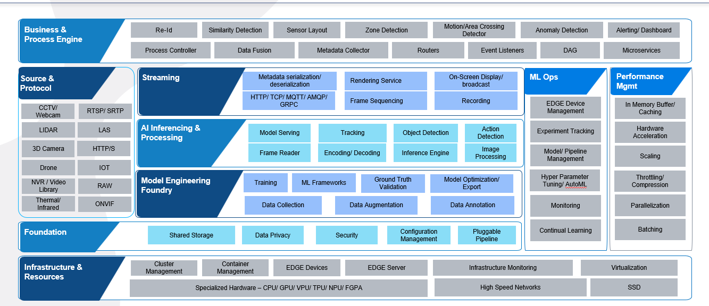
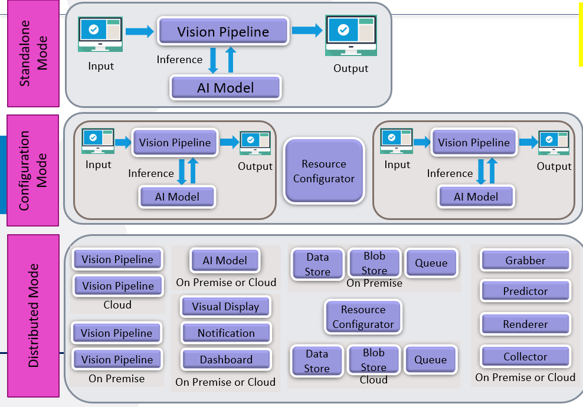

# Infosys Video Analytics (IVA)

**Infosys Video Analytics (IVA)** is a next-generation platform designed to deliver intelligent media and sensor data processing through seamless integration with **AI, Cloud, Edge, and Vision technologies**. It supports a wide range of input types—including **video, images, sensor data, and point cloud data**—making it a versatile solution for real-world applications.

Infosys Video Analytics seamlessly blends Cloud, Edge, AI & Vision technologies. Positioned at convergence of these cutting -edge advancements, IVA offers a flexible, vendor-neutral approach to manage hardware and software resources for end-to-end Computer Vision App services. The enterprise-ready Reference implementations caters to industries from retail to entertainment. 

## Why IVA?

IVA sits at the **crossroads of Cloud, Edge, AI, and Vision**, helping traditional enterprises transition into the digital age. Despite the transformative potential of these technologies, they remain underutilized. IVA bridges this gap with a **comprehensive, enterprise-ready solution**. Elevate your work with IVA - the bridge from traditional to digital.

## Table of Contents

1. [Key Capabilities](#key-capabilities)
2. [Advanced Capabilities & R&D Focus](#advanced-capabilities--rd-focus)
3. [Supported AI Use Cases](#supported-ai-use-cases)
4. [Privacy and Security](#privacy-and-security)
5. [Additional Capabilities](#additional-capabilities)
6. [Capability Architecture](#capability-architecture)
7. [Modules of IVA](#modules-of-iva)
8. [New Features in Release IVA-3.5](#new-features-in-release-iva-35)
9. [References](#references)

## Key Capabilities

- **Multi-Modal Input Support**: Accepts **video, images, sensor data, and point cloud data**, enabling a wide range of computer vision and perception applications.
- **End-to-End Computer Vision Services**: Train, develop, deploy, and operate vision applications with a unified platform that manages both hardware and software resources.
- **Generative AI Integration**: Leverages **next-gen Generative AI models** for advanced vision tasks such as synthetic data generation, scene reconstruction, and intelligent augmentation.
- **Technology Agnostic & Flexible**: Avoid vendor lock-in with a **vendor-neutral architecture** that supports best-of-breed tools and frameworks.
- **Hardware & Platform Compatibility**: Works seamlessly with **NVIDIA Jetson, Raspberry Pi, drones, depth cameras, Lidar, sensors**, and more—across **on-premise, cloud, and edge** environments.
- **Collaborative Ecosystem**: Built in collaboration with **OEMs, hyperscalers, and software partners like Microsoft, AWS, Data Loop, Nvidia**, ensuring adaptability to diverse enterprise needs.
- **Scalable Global Deployment**: Backed by Infosys’ global services model, IVA is ready for **enterprise-scale deployment** with reliability and support.
- **Performance Ready**: Asynchronous processing on CPU / GPU, rendering enhancements, Batch processing, enhanced usage of CPU threads.

- **Continuous Innovation**: The latest release, **IVA 3.5**, brings a major upgrade from .NET 6.0 to **.NET 8.0**, offering improved performance, compatibility, and access to the latest features.

## Advanced Capabilities & R&D Focus

- **Lidar, Depth Cameras, and Stereo Cameras**: Advanced work is being done to integrate these technologies for enhanced perception capabilities.
- **Micro-controller Integration**: Efforts are underway to support micro-controllers for edge AI applications.
- **OpenVINO and Intel Chip Optimizations**: Ongoing R&D to optimize IVA for Intel hardware using OpenVINO toolkit.

- **Advanced Problems and their Solution**: Advanced work on Visual QnA, video shortening, person Re-ID problem, vector embedding, synthetic data generation

## Supported AI Use Cases

IVA supports a wide range of AI use cases, including:

### Generative AI

- Prompts & Hyper Parameters: Input text to AI model based on which model generates image / video or identifies classes in image / video. Prompts can be supplied as offline or live (real time). Provision to supply parameters to AI model which tunes the output from model can be provided offline or live
- Image Transformation: In-painting, out-painting, super resolution
- Image Captioning: Providing detailed description of a given image or frame in a video
- Visual QnA: Getting information about an image, asking queries
- Image Generation: Providing input text to AI model based on which model generates image / video

### Advanced AI

- 3D Reconstruction: Converting 2D images to 3D for better visualization, reconstruction
- Foundation Models: Support for Grounding Dino, Video LLaVa, Stable Diffusion, SAM, mPLUG
- Explainability: Providing explanation in detail on how an AI model made decision and arrived on an output. Techniques used - IG, Lime, Scorecam, Layercam, GradCam, Shap, CounterFactual, Partial Dependence Plots, Integrated Gradients

### Others
- Point Cloud Data (PCD)
- Object Detection
- Classification
- Pose Estimation
- Segmentation
- Tracking
- Action Recognition
- Visual Summary
- Template Matching
- Face Analysis
- Depth Estimation
- OCR

## Privacy and Security

Infosys Video Analytics (IVA) ensures robust privacy and security by storing confidential information in secure cloud-based key vaults. Supported services include:
- **Azure Key Vault**
- **AWS Secrets Manager**

This approach helps safeguard sensitive data and aligns with industry best practices for secure credential and secret management.

## Additional Capabilities

- **Vertical Industry Workflows**: Pre-built workflows to bootstrap vision AI adoption across various industries.
- **Choice of AI Platforms**: Support for native deep learning libraries or bring-your-own models and AI platforms qualified by customers.
- **Specialized Building Blocks**: A suite of specialized building blocks and services to develop, deploy, and operate enterprise-grade vision AI applications.
- **Diverse Deployment Scenarios**: Supports deployment on specialized and off-the-shelf hardware, including workstation/standalone, edge, enterprise scale, and hybrid environments.
- **Multi-Sensory Integration**: Supports multi-sensory integrations to aid the development of cross-modal perception capabilities.
- **Model Chaining**: Supports model chaining, allowing multiple types of AI models to be connected in sequence or parallel to get consolidated output.

## Capability Architecture

This architecture delivers a comprehensive AI vision pipeline designed for real-time, multi-source video analytics. It integrates diverse input protocols (CCTV, LIDAR, drones, etc.) with a robust streaming layer and advanced AI inferencing. The system supports full model lifecycle management, from data engineering to deployment, with strong MLOps and edge capabilities. Built on a modular foundation, it ensures scalability, performance optimization, and seamless integration with specialized hardware and infrastructure.

## Deployment Architecture

The Deployment Architecture illustrates how IVA components are orchestrated across various environments—cloud, edge, and on-premises. It highlights the flow of data from multiple input sources (such as CCTV, LIDAR, and drones) through the streaming and AI inference layers, and demonstrates how modules are deployed for scalability, high availability, and performance optimization. The architecture supports integration with specialized hardware accelerators, secure communication between services, and robust lifecycle management for AI models. This modular approach ensures seamless deployment, monitoring, and management of vision analytics workloads in diverse enterprise scenarios.

## Modules of IVA

  **Frame Grabber**: Read input stream, captures frames from the stream, performs pre-processing.

  **AI Predictor**: Instantiates right AI Model. passes frames for inference and gets results from API.

  **Frame Renderer**: Renders the final output by superimposing Model prediction data on the frames.

  **Data Collector**: Collects inference data and stores in database for further analysis, reporting, analytics, notification and for downstream applications.

  **Prompt Handler**: Real time and offline prompt injection for Generative AI models and conventional models.

  **Point Cloud Data Processor**: To read and process Point Cloud Data (PCD) enabling seamless ingestion of 3D spatial data.

  **Explainer Predictor**: Generating Explainability for predicted data by any AI model. It gets detailed explanation on how a AI Models arrived at a conclusion.

### New Features in Release IVA-3.5

#### IVA Core pipeline features -

#### IMIL Library 

This library will helps in testing the local python inference with IVA for different models. 
- IMIL library is used to test local python inference testing with IVA, as its easy to deploy, single library for local invocation with provision for adding custom models, we need the library folder with the help of that the iva will run the local python execution.
For more information like setup and usage, refer the open source [link](https://github.com/Infosys/Infosys-Model-Inference-Library)

#### PCD Handling 

This component is independent and also helps in reading PCD – Point Cloud Data files in any format.
- Prompt handler enables usage of prompts in IVA pipeline. IVA will be able to use models that can accept prompt as input with prompt handler. Prompts can be provided before the start of the process or at runtime in a text file. 
- Prompt Handler node is independent and can read prompts from a text file giving the ability to allow other inputs with prompt like video or image. Using prompt templates, Prompt handler will structure the prompt in a format which can be accepted/read by the model as input. 
- Prompt Injector is used to read the prompt from an external source, and this is done using LIF adapters. An external source will send a prompt to Kafka server which prompt injector is listens to via adapters. It reads the prompt from Kafka server and injects it into prompt handler. The prompt handler further uses the prompt to process, format it is using a prompt template defined.  

#### Explainability 

This component that is responsible for handling Explainability for the predicted frames from AI Predictor and Save the data into database. 
- Explainability support is provided for the predicted frame from AI predictor node, based on the template configured in the Database and Device.json. It supports explainability based on the confidence score, label etc., based on the template configured in the database.

#### Data Aggregator 

This component handles the messages from multiple frame processor nodes and aggregates the predicted data as per the frame id and forwards it to the next node in the pipeline. 

#### Frame Viewer: 

Frame Viewer is a new component added in IVA to perform any kind of operation on raw data using ffmpeg. 

#### Prompt Handling: 
- Prompt handler enables usage of prompts in IVA pipeline. IVA will be able to use models that can accept prompt as input with prompt handler. Prompts can be provided before the start of the process or at runtime in a text file. 
- Prompt Handler node is independent and can read prompts from a text file giving the ability to allow other inputs with prompt like video or image. Using prompt templates, Prompt handler will structure the prompt in a format which can be accepted/read by the model as input. 
- Prompt Injector is used to read the prompt from an external source, and this is done using LIF adapters. An external source will send a prompt to Kafka server which prompt injector is listens to via adapters. It reads the prompt from Kafka server and injects it into prompt handler. The prompt handler further uses the prompt to process, format it is using a prompt template defined. 

#### Multi Model Chaining: 
- Model chaining feature lets us use IVA to run multiple AI models that can be configured in the pipeline either in sequence or in parallel. In this release only frame processor supports model chaining feature. 
- With model chaining, IVA has the capability to merge the inference results from multiple models configured in the pipeline. Inference data of one model can be sent as input to another model. Data can be merged and utilized to increase consistency and accuracy.

#### LIF features -

#### Secret Configurations: 
- IVA configurations which are sensitive or need to be secured can be stored in Azure or AWS services. These stored configurations or information can be retrieved using LIF adapters which include the support for both Azure and AWS. 

#### Rabbit MQ:  
- Rabbit MQ is an open-source message/event streaming platform. Configured to send messages across components of IVA. Can also be configured to send messages out of IVA as they are stored in topics and accessed by the applications/components or external sources. 

#### Azure IOT:  
- Azure Iot Adapter is configured to send messages across components of IVA. It uses Azure IoT Hub as a medium to receive messages and store in Azure Queue which can be accessed by the applications/components or external sources.

#### Kafka:  
- Kafka is an open-source message/event streaming platform. Configured to send messages across components of IVA. Can also be configured to send messages out of IVA as they are stored in topics and accessed by the applications/components or external sources. 

### Storage Services 

- Windows MSMQ [works only on windows] 
- IIS 8.5 and above [works only on windows] 
- Kafka 3.1.x and above 
- Java 7.1.x and above 
- Microsoft SQL Server database [optional, required only when metadata store is needed] 
- Elasticsearch 8.8.1 
- PostgreSQL 14 

## References

For sample input schema examples, please read[Docs/IVA-Input_Schema.md](Docs/IVA-Input_Schema.md)
For sample output schema, please read [Docs/IVA-Output_Schema.md)](Docs/IVA-Output_Schema.md)
